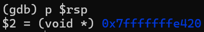

# <center>Report to Bomblab</center>

## What can we learn from Bomblab

通过完成bomblab，学生可以提高阅读汇编代码和使用gdb进行调试的能力，对计算机底层架构也会有更清晰的认知。更重要的是，在这个过程中，你的分析问题、逐步推理到最后解决问题的能力都可以得到锻炼，而这项能力不光在计算机编程领域，在其他工科上也都是十分重要的。

## How should Bomblab be conducted

### Preview

#### bomb.c

首先查看bomb.c文件，我们得知了我们大概要做的事情：整个炸弹分为6关，每一关都要求输入一行字符串，然后将输入的字符串放到*phase_x*中运行，如果输入正确，则会继续进入下一关，不正确则会引爆炸弹。但是所有函数的具体实现细节都被封装了起来，我们从c语言文件中无法看出函数的具体执行细节。那么我们怎么样才能知道正确的字符串是什么呢？这时候便要查看反汇编bomb.txt文件。

#### bomb.txt

整个反汇编文件竟有两千行左右！初看有点令人望而生畏。但是我们可以把整个文件拆分成不同的组成部分。*main*函数之前的三百多行都是标准库函数的声明，对我们来说这部分是没用的。*main*函数就是我们在bomb.c文件中看到的*main*函数的汇编代码，用处也不大。之后便是1~6关函数的汇编代码，我们在c语言文件中看不到的部分，这部分对我们来说是主要需要阅读的部分。而且我们发现在汇编代码中，1-6关之后还有一个**secret_phase**，提醒我们解完1-6关之后还需要留意一下这个隐藏关卡。剩下的部分便是执行主体之外的功能的函数，譬如将你炸弹爆炸的信息发送给助教之类。这类函数我们也无需关心。

!!! info
我们可以看到在反汇编代码中，每一条指令前面都有对应的地址。但是注意，这个地址并不是程序实际运行时代码文件所存储的地址，具体的地址根据不同的机器而不同，需要在gdb中查看。

---

### Defuse

#### phase_1

首先观察*phase_1*函数。在程序的一开始，它将一段地址0x1b5a(%rip)加载到了%rsi中。我们暂时不知道这里面存放了什么内容，所以继续往下看。之后我们发现它调用了一个名为*strings_not_equal*的函数。`test   %eax,%eax;jne    1604 <phase_1+0x1d>`这段代码表明，如果返回值不等于0，则会跳转到*explode_bomb*函数。所以我们的目标是使*strings_not_equal*函数的返回值 **等于0** ，才不会使炸弹爆炸。

```assembly
00000000000015e7 <phase_1>:
    15e7:	f3 0f 1e fa          	endbr64
    15eb:	48 83 ec 08          	sub    $0x8,%rsp
    15ef:	48 8d 35 5a 1b 00 00 	lea    0x1b5a(%rip),%rsi        # 3150 <_IO_stdin_used+0x150>
    15f6:	e8 b4 05 00 00       	call   1baf <strings_not_equal>
    15fb:	85 c0                	test   %eax,%eax
    15fd:	75 05                	jne    1604 <phase_1+0x1d>
    15ff:	48 83 c4 08          	add    $0x8,%rsp
    1603:	c3                   	ret
    1604:	e8 96 08 00 00       	call   1e9f <explode_bomb>
    1609:	eb f4                	jmp    15ff <phase_1+0x18>
```

我们再来阅读*strings_not_equal*函数，发现它的功能恰如其名。1bb7和1bba将%rdi和%rsi移到%rbx和%rbp中，说明我们要比较的2个字符串就存在这两个寄存器中。之后便是先比较2个字符串的长度是否相等，再比较它们的内容是否相等，相等则返回0，不相等则返回1。

```assembly
0000000000001baf <strings_not_equal>:
    1baf:	f3 0f 1e fa          	endbr64
    1bb3:	41 54                	push   %r12
    1bb5:	55                   	push   %rbp
    1bb6:	53                   	push   %rbx
    1bb7:	48 89 fb             	mov    %rdi,%rbx
    1bba:	48 89 f5             	mov    %rsi,%rbp
    1bbd:	e8 cc ff ff ff       	call   1b8e <string_length>
    1bc2:	41 89 c4             	mov    %eax,%r12d
    1bc5:	48 89 ef             	mov    %rbp,%rdi
    1bc8:	e8 c1 ff ff ff       	call   1b8e <string_length>
    1bcd:	89 c2                	mov    %eax,%edx
    1bcf:	b8 01 00 00 00       	mov    $0x1,%eax
    1bd4:	41 39 d4             	cmp    %edx,%r12d
    1bd7:	75 31                	jne    1c0a <strings_not_equal+0x5b>
    1bd9:	0f b6 13             	movzbl (%rbx),%edx
    1bdc:	84 d2                	test   %dl,%dl
    1bde:	74 1e                	je     1bfe <strings_not_equal+0x4f>
    1be0:	b8 00 00 00 00       	mov    $0x0,%eax
    1be5:	38 54 05 00          	cmp    %dl,0x0(%rbp,%rax,1)
    1be9:	75 1a                	jne    1c05 <strings_not_equal+0x56>
    1beb:	48 83 c0 01          	add    $0x1,%rax
    1bef:	0f b6 14 03          	movzbl (%rbx,%rax,1),%edx
    1bf3:	84 d2                	test   %dl,%dl
    1bf5:	75 ee                	jne    1be5 <strings_not_equal+0x36>
    1bf7:	b8 00 00 00 00       	mov    $0x0,%eax
    1bfc:	eb 0c                	jmp    1c0a <strings_not_equal+0x5b>
    1bfe:	b8 00 00 00 00       	mov    $0x0,%eax
    1c03:	eb 05                	jmp    1c0a <strings_not_equal+0x5b>
    1c05:	b8 01 00 00 00       	mov    $0x1,%eax
    1c0a:	5b                   	pop    %rbx
    1c0b:	5d                   	pop    %rbp
    1c0c:	41 5c                	pop    %r12
    1c0e:	c3                   	ret
```

我们再回到*main*函数。在*phase_1*函数调用之前，*read_line*函数让我们输入一行字符串。之后，将函数的返回值，即%rax中的值移到了%rdi中，说明 **%rdi** 中存放的就是我们输入的字符串的地址。那么更加印证了 **%rsi** 存放的就是我们要比较的字符串的地址。

```assembly
    14e0:	e8 41 0a 00 00       	call   1f26 <read_line>
    14e5:	48 89 c7             	mov    %rax,%rdi
    14e8:	e8 fa 00 00 00       	call   15e7 <phase_1>
```

既然要使*strings_not_equal*函数的返回值为0，就要使%rdi和%rsi中的字符串相等，也就是我们输入的字符串要与%rsi中的字符串相等。

那么我们现在的任务便成了找到%rsi中存放的字符串到底是什么。还记得我们之前在*phase_1*函数中，代码将一段地址0x1b5a(%rip)加载到了%rsi中，似乎说明0x1b5a(%rip)就存放着我们想要的字符串。但是这个字符串我们该如何找到呢？

事实上我们阅读反汇编代码是找不到的。因为这个字符串属于**字符串常量**，它存储在数据区，而不是程序代码所在的文本区。所以我们使用gdb调试工具，在*strings_not_equal*函数处设置断点。程序暂停后，我们输入`x/16xg $rsi`查看%rsi指向的内存的值，得到了如下信息。


由于我们使用的是**小端法**机器，所以一个四字内字节顺序是颠倒的。首先将字节顺序反转，得到正确的顺序。其次我们再找到0x00，即字符串结束符'\0'，表示字符串的结束。最后对照ascii码表，将每个字节内的十六进制数字翻译为字符，得到了下面这个字符串：

==The moon unit will be divided into two divisions.==
（注意句号不能省）

至此，第一关成功解出。🎉

!!! Note
那么有人可能会问：为什么不可以直接查看0x1b5a(%rip)的值？答案是可以。我们首先需要知道%rip是什么类型的寄存器。经查阅资料可知，%rip就是程序计数器(PC)，它存放的是程序将要执行的下一条指令所在的地址。所以%rip的值会一直随着程序的运行而改变。当程序运行到`lea    0x1b5a(%rip),%rsi`这条指令时，根据现代流水线架构，程序在完成取指(Fetch)的同时就会更新程序计数器的值，使其指向下一条指令。随后在执行(Execute)阶段，会将这个更新后的程序计数器的值加上0x1b5a，作为下一阶段访存(Memory)的地址。所以%rsi的值，实际上是下一条指令的地址，即0x5555555555f6，加0x1b5a，是0x555555557150。这就是字符串的存放地址。

#### phase_2

首先观察*phase_2*函数，它在开头调用了一个名为*read_six_numbers*的函数，我们猜测它的功能应该是读入6个数字。

```assembly
000000000000160b <phase_2>:
    160b:	f3 0f 1e fa          	endbr64
    160f:	55                   	push   %rbp
    1610:	53                   	push   %rbx
    1611:	48 83 ec 28          	sub    $0x28,%rsp
    1615:	64 48 8b 04 25 28 00 	mov    %fs:0x28,%rax
    161c:	00 00 
    161e:	48 89 44 24 18       	mov    %rax,0x18(%rsp)
    1623:	31 c0                	xor    %eax,%eax
    1625:	48 89 e6             	mov    %rsp,%rsi
    1628:	e8 b4 08 00 00       	call   1ee1 <read_six_numbers>
    162d:	83 3c 24 00          	cmpl   $0x0,(%rsp)
    1631:	75 07                	jne    163a <phase_2+0x2f>
    1633:	83 7c 24 04 01       	cmpl   $0x1,0x4(%rsp)
    1638:	74 05                	je     163f <phase_2+0x34>
    163a:	e8 60 08 00 00       	call   1e9f <explode_bomb>
    163f:	48 89 e3             	mov    %rsp,%rbx
    1642:	48 8d 6c 24 10       	lea    0x10(%rsp),%rbp
    1647:	eb 0e                	jmp    1657 <phase_2+0x4c>
    1649:	e8 51 08 00 00       	call   1e9f <explode_bomb>
    164e:	48 83 c3 04          	add    $0x4,%rbx
    1652:	48 39 eb             	cmp    %rbp,%rbx
    1655:	74 0c                	je     1663 <phase_2+0x58>
    1657:	8b 43 04             	mov    0x4(%rbx),%eax
    165a:	03 03                	add    (%rbx),%eax
    165c:	39 43 08             	cmp    %eax,0x8(%rbx)
    165f:	74 ed                	je     164e <phase_2+0x43>
    1661:	eb e6                	jmp    1649 <phase_2+0x3e>
    1663:	48 8b 44 24 18       	mov    0x18(%rsp),%rax
    1668:	64 48 33 04 25 28 00 	xor    %fs:0x28,%rax
    166f:	00 00 
    1671:	75 07                	jne    167a <phase_2+0x6f>
    1673:	48 83 c4 28          	add    $0x28,%rsp
    1677:	5b                   	pop    %rbx
    1678:	5d                   	pop    %rbp
    1679:	c3                   	ret
    167a:	e8 d1 fb ff ff       	call   1250 <__stack_chk_fail@plt>
```

我们来仔细阅读这个函数。%rsi之前在*phase_2*函数中已经被赋值为%rsp，即栈指针的值。后面一系列lea指令我们感到疑惑，暂且不管。之后我们可以看到它调用了一个标准库函数*sscanf*。在我们的汇编代码中，我们看不到这个函数的实现细节，因为它存放在动态链接库(Dynamic Link Library)中，但是我们可以通过查阅手册来查看这个函数的参数和功能。

> int sscanf( const char *buffer, const char *format, ... );

经查阅可知，sscanf是一个读进标准化字符串的函数。`sscanf("1 2 3", "%d %d %d", &a, &b, &c)`这是它的一个使用示例，它将字符串的数据按指定格式解析到变量中。同时，它的返回值是一个整型数字，表示成功读取的变量数目，失败时返回EOF（通常是-1）。

`cmp    $0x5,%eax;jle    1f21 <read_six_numbers+0x40>`从后面这段代码中我们可以看出，当sscanf函数的返回值小于等于5时，炸弹会爆炸，即成功读取的变量数目应该**等于6**。到现在，我们应该大概明白前面那一系列lea指令起什么作用了。它们将栈上的指定地址移到寄存器中，*sscanf*函数会调用这些寄存器，将读取进的变量存放到寄存器中的地址，也就是存放到栈上。我们已经搞懂了*read_six_numbers*函数的功能：**它将我们输入的字符串解析为6个数字，并存放在栈中。**

```assembly
0000000000001ee1 <read_six_numbers>:
    1ee1:	f3 0f 1e fa          	endbr64
    1ee5:	48 83 ec 08          	sub    $0x8,%rsp
    1ee9:	48 89 f2             	mov    %rsi,%rdx
    1eec:	48 8d 4e 04          	lea    0x4(%rsi),%rcx
    1ef0:	48 8d 46 14          	lea    0x14(%rsi),%rax
    1ef4:	50                   	push   %rax
    1ef5:	48 8d 46 10          	lea    0x10(%rsi),%rax
    1ef9:	50                   	push   %rax
    1efa:	4c 8d 4e 0c          	lea    0xc(%rsi),%r9
    1efe:	4c 8d 46 08          	lea    0x8(%rsi),%r8
    1f02:	48 8d 35 00 15 00 00 	lea    0x1500(%rip),%rsi        # 3409 <array.3474+0x229>
    1f09:	b8 00 00 00 00       	mov    $0x0,%eax
    1f0e:	e8 dd f3 ff ff       	call   12f0 <__isoc99_sscanf@plt>
    1f13:	48 83 c4 10          	add    $0x10,%rsp
    1f17:	83 f8 05             	cmp    $0x5,%eax
    1f1a:	7e 05                	jle    1f21 <read_six_numbers+0x40>
    1f1c:	48 83 c4 08          	add    $0x8,%rsp
    1f20:	c3                   	ret
    1f21:	e8 79 ff ff ff       	call   1e9f <explode_bomb>
```

我们回到*phase_2*函数接着往下读。162d将(%rsp)的值和0比较，1633将0x4(%rsp)的值和1比较，如果不相等，炸弹会爆炸。这说明 **(%rsp)的值应该是0，0x4(%rsp)的值应该是1**。

接下来的代码有些复杂，但它应该是要实现一个循环语句。163f将当前栈指针的值移到了%rbx中，1642将0x10(%rsp)加载到了%rbp中，这应该是作为循环结束的标志（哨兵）。接下来程序将(%rbx)和0x4(%rbx)中的值相加，将结果和0x8(%rbx)中的值比较。我们已经知道(%rsp)和0x4(%rsp)中的值分别是0和1，所以0x8(%rsp)中的值应当是它们的和，即$0 + 1 = 1$。之后会更新%rbx的值，加0x4，重复以上操作，直到%rbx等于%rbp，退出循环。所以这个循环实现了使每个数（除了前两个数）都是前两个数字之和，这就是我们熟悉的**斐波那契数列**。由于只要求6个数字，所以我们的最终答案是：

==0 1 1 2 3 5==

gdb中显示的结果也验证了我们输入的顺序是没错的。


至此，第二关成功解出。🎉

#### phase_3

首先观察*phase_3*函数，发现它有些不一样，因为它有大量重复的代码段。而且我们又看到16d4有这样一行代码`notrack jmp *%rax`，似乎有些熟悉。对，这就是**switch**语句。函数一开始调用了一个*sscanf*函数，从`cmp    $0x2,%eax;jle    16d7 <phase_3+0x58>`得知，它应该读取了**3**个变量。`cmpl   $0x7,0x10(%rsp);ja     17cc <phase_3+0x14d>`告诉我们0x10(%rsp)中的值**小于等于7**。16c6将跳转表的首地址加载到了%rdx中。`movslq (%rdx,%rax,4),%rax`这句代码将%rax中的数作为索引i，也就是0x10(%rsp)，取出跳转表的第i个元素，也就是需要跳转的地址。所以我们确定，**0x10(%rsp)**中存放的数字，就是switch语句需要判断的值，且它的范围是0~7。


打开gdb调试，我们通过查看%rdx寄存器的值，获得了跳转表的首地址为0x5555555571c0，这个地址无疑超过了代码文件的范围，所以跳转表中存放的相对地址应该是负数。我们打印出%rdx指向的内存的具体内容，发现果然如此。我们将地址计算结果呈现在下表中：

| 相对地址| 绝对地址 | 在反汇编文件中的地址 |
|:-:|:-:|:-:|
| ffffe51e | 5555555556de | 16de |
| ffffe540 | 555555555700 | 1700 |
| ffffe562 | 555555555722 | 1722 |
| ffffe584 | 555555555744 | 1744 |
| ffffe5a0 | 555555555760 | 1760 |
| ffffe5bb | 55555555577b | 177b |
| ffffe5d6 | 555555555796 | 1796 |
| ffffe5f1 | 5555555557b1 | 17b1 |

```
000000000000167f <phase_3>:
    167f:	f3 0f 1e fa          	endbr64
    1683:	48 83 ec 28          	sub    $0x28,%rsp
    1687:	64 48 8b 04 25 28 00 	mov    %fs:0x28,%rax
    168e:	00 00 
    1690:	48 89 44 24 18       	mov    %rax,0x18(%rsp)
    1695:	31 c0                	xor    %eax,%eax
    1697:	48 8d 4c 24 0f       	lea    0xf(%rsp),%rcx
    169c:	48 8d 54 24 10       	lea    0x10(%rsp),%rdx
    16a1:	4c 8d 44 24 14       	lea    0x14(%rsp),%r8
    16a6:	48 8d 35 01 1b 00 00 	lea    0x1b01(%rip),%rsi        # 31ae <_IO_stdin_used+0x1ae>
    16ad:	e8 3e fc ff ff       	call   12f0 <__isoc99_sscanf@plt>
    16b2:	83 f8 02             	cmp    $0x2,%eax
    16b5:	7e 20                	jle    16d7 <phase_3+0x58>
    16b7:	83 7c 24 10 07       	cmpl   $0x7,0x10(%rsp)
    16bc:	0f 87 0a 01 00 00    	ja     17cc <phase_3+0x14d>
    16c2:	8b 44 24 10          	mov    0x10(%rsp),%eax
    16c6:	48 8d 15 f3 1a 00 00 	lea    0x1af3(%rip),%rdx        # 31c0 <_IO_stdin_used+0x1c0>
    16cd:	48 63 04 82          	movslq (%rdx,%rax,4),%rax
    16d1:	48 01 d0             	add    %rdx,%rax
    16d4:	3e ff e0             	notrack jmp *%rax
```

每一个跳转分支执行的操作都是基本相同的，我们观察其中一个。当索引为0时，代码会跳转到16de。它先将0x73移到%rax中，再将0x14(%rsp)中的值和$0x326比较，如果相等，会跳转到17d6--这个8个代码块都共用的跳转地址。它会将0xf(%rsp)中的值和%rax中的值，也就是0x73比较，如果相等，则会安全退出。

```assembly
    16d7:	e8 c3 07 00 00       	call   1e9f <explode_bomb>
    16dc:	eb d9                	jmp    16b7 <phase_3+0x38>
    16de:	b8 73 00 00 00       	mov    $0x73,%eax
    16e3:	81 7c 24 14 26 03 00 	cmpl   $0x326,0x14(%rsp)
    16ea:	00 
    16eb:	0f 84 e5 00 00 00    	je     17d6 <phase_3+0x157>
    16f1:	e8 a9 07 00 00       	call   1e9f <explode_bomb>
    16f6:	b8 73 00 00 00       	mov    $0x73,%eax
    16fb:	e9 d6 00 00 00       	jmp    17d6 <phase_3+0x157>
    1700:	b8 78 00 00 00       	mov    $0x78,%eax
    1705:	81 7c 24 14 12 02 00 	cmpl   $0x212,0x14(%rsp)
    170c:	00 
    170d:	0f 84 c3 00 00 00    	je     17d6 <phase_3+0x157>
    1713:	e8 87 07 00 00       	call   1e9f <explode_bomb>
    1718:	b8 78 00 00 00       	mov    $0x78,%eax
    171d:	e9 b4 00 00 00       	jmp    17d6 <phase_3+0x157>
    1722:	b8 72 00 00 00       	mov    $0x72,%eax
    1727:	81 7c 24 14 83 02 00 	cmpl   $0x283,0x14(%rsp)
    172e:	00 
    172f:	0f 84 a1 00 00 00    	je     17d6 <phase_3+0x157>
    1735:	e8 65 07 00 00       	call   1e9f <explode_bomb>
    173a:	b8 72 00 00 00       	mov    $0x72,%eax
    173f:	e9 92 00 00 00       	jmp    17d6 <phase_3+0x157>
    1744:	b8 64 00 00 00       	mov    $0x64,%eax
    1749:	83 7c 24 14 54       	cmpl   $0x54,0x14(%rsp)
    174e:	0f 84 82 00 00 00    	je     17d6 <phase_3+0x157>
    1754:	e8 46 07 00 00       	call   1e9f <explode_bomb>
    1759:	b8 64 00 00 00       	mov    $0x64,%eax
    175e:	eb 76                	jmp    17d6 <phase_3+0x157>
    1760:	b8 61 00 00 00       	mov    $0x61,%eax
    1765:	81 7c 24 14 c8 03 00 	cmpl   $0x3c8,0x14(%rsp)
    176c:	00 
    176d:	74 67                	je     17d6 <phase_3+0x157>
    176f:	e8 2b 07 00 00       	call   1e9f <explode_bomb>
    1774:	b8 61 00 00 00       	mov    $0x61,%eax
    1779:	eb 5b                	jmp    17d6 <phase_3+0x157>
    177b:	b8 61 00 00 00       	mov    $0x61,%eax
    1780:	81 7c 24 14 09 01 00 	cmpl   $0x109,0x14(%rsp)
    1787:	00 
    1788:	74 4c                	je     17d6 <phase_3+0x157>
    178a:	e8 10 07 00 00       	call   1e9f <explode_bomb>
    178f:	b8 61 00 00 00       	mov    $0x61,%eax
    1794:	eb 40                	jmp    17d6 <phase_3+0x157>
    1796:	b8 62 00 00 00       	mov    $0x62,%eax
    179b:	81 7c 24 14 47 03 00 	cmpl   $0x347,0x14(%rsp)
    17a2:	00 
    17a3:	74 31                	je     17d6 <phase_3+0x157>
    17a5:	e8 f5 06 00 00       	call   1e9f <explode_bomb>
    17aa:	b8 62 00 00 00       	mov    $0x62,%eax
    17af:	eb 25                	jmp    17d6 <phase_3+0x157>
    17b1:	b8 68 00 00 00       	mov    $0x68,%eax
    17b6:	81 7c 24 14 02 03 00 	cmpl   $0x302,0x14(%rsp)
    17bd:	00 
    17be:	74 16                	je     17d6 <phase_3+0x157>
    17c0:	e8 da 06 00 00       	call   1e9f <explode_bomb>
    17c5:	b8 68 00 00 00       	mov    $0x68,%eax
    17ca:	eb 0a                	jmp    17d6 <phase_3+0x157>
    17cc:	e8 ce 06 00 00       	call   1e9f <explode_bomb>
    17d1:	b8 6c 00 00 00       	mov    $0x6c,%eax
    17d6:	38 44 24 0f          	cmp    %al,0xf(%rsp)
    17da:	75 15                	jne    17f1 <phase_3+0x172>
    17dc:	48 8b 44 24 18       	mov    0x18(%rsp),%rax
    17e1:	64 48 33 04 25 28 00 	xor    %fs:0x28,%rax
    17e8:	00 00 
    17ea:	75 0c                	jne    17f8 <phase_3+0x179>
    17ec:	48 83 c4 28          	add    $0x28,%rsp
    17f0:	c3                   	ret
    17f1:	e8 a9 06 00 00       	call   1e9f <explode_bomb>
    17f6:	eb e4                	jmp    17dc <phase_3+0x15d>
    17f8:	e8 53 fa ff ff       	call   1250 <__stack_chk_fail@plt>
```

所以我们现在大概明白了这个函数在做什么事情：它先从输入的字符串中读取3个值，将它们分别加载到0xf(%rsp)，0x10(%rsp)，0x14(%rsp)中，然后switch语句根据0x10(%rsp)中的值确定要跳转的case，然后将0xf(%rsp)和0x14(%rsp)中的值和目标值进行比较。

我们注意到0xf(%rsp)只使用了1个字节，于是我们猜测它是**char**类型，而0x10(%rsp)和0x14(%rsp)都是4个字节，于是我们猜测它们是int类型。gdb调试中有关sscanf函数的信息向我们确认了这一点。


我们确定了输入变量的类型，随后就要确定输入变量的顺序。通过上面的信息我们可以确认0xf(%rsp)对应第二个变量。但是0x10(%rsp)和0x14(%rsp)对应的输入顺序是怎么样的。我们可以尝试输入然后监看内存的值。




最后我们确认：sscanf中第1个变量对应0x10(%rsp)，第2个变量对应0xf(%rsp)，第3个变量对应0x14(%rsp)。于是我们总结出下面这张表格：

| 0x10(%rsp) | 0 | 1 | 2 | 3 | 4 | 5 | 6 | 7 |
|:-:|:-:|:-:|:-:|:-:|:-:|:-:|:-:|:-:|
| 0xf(%rsp) | s(0x73) | x(0x78) | r(0x72) | d(0x64) | a(0x61) | a(0x61) | b(0x62) | h(0x68) |
| 0x14(%rsp) | 806(0x326) | 530(0x212) | 643(0x283) | 84(0x54) | 968(0x3c8) | 265(0x109) | 839(0x347) | 770(0x302) |

其中的每一列都是答案。

至此，第三关成功解出。🎉

#### phase_4

首先观察*phase_4*函数，它的开头调用了*sscanf*函数。从`cmp    $0x2,%eax;jne    186a <phase_4+0x37>`得知，它读取了2个变量。`cmpl   $0xe,(%rsp);jbe    186f <phase_4+0x3c>`表明(%rsp)中的值应当**小于等于0xe**。之后将%rdx赋值为0xe，%rsi赋值为0，%rdi赋值为(%rsp)中的值后，就进入了*func4*。

```assembly
0000000000001833 <phase_4>:
    1833:	f3 0f 1e fa          	endbr64
    1837:	48 83 ec 18          	sub    $0x18,%rsp
    183b:	64 48 8b 04 25 28 00 	mov    %fs:0x28,%rax
    1842:	00 00 
    1844:	48 89 44 24 08       	mov    %rax,0x8(%rsp)
    1849:	31 c0                	xor    %eax,%eax
    184b:	48 8d 4c 24 04       	lea    0x4(%rsp),%rcx
    1850:	48 89 e2             	mov    %rsp,%rdx
    1853:	48 8d 35 bb 1b 00 00 	lea    0x1bbb(%rip),%rsi        # 3415 <array.3474+0x235>
    185a:	e8 91 fa ff ff       	call   12f0 <__isoc99_sscanf@plt>
    185f:	83 f8 02             	cmp    $0x2,%eax
    1862:	75 06                	jne    186a <phase_4+0x37>
    1864:	83 3c 24 0e          	cmpl   $0xe,(%rsp)
    1868:	76 05                	jbe    186f <phase_4+0x3c>
    186a:	e8 30 06 00 00       	call   1e9f <explode_bomb>
    186f:	ba 0e 00 00 00       	mov    $0xe,%edx
    1874:	be 00 00 00 00       	mov    $0x0,%esi
    1879:	8b 3c 24             	mov    (%rsp),%edi
    187c:	e8 7c ff ff ff       	call   17fd <func4>
    1881:	83 f8 15             	cmp    $0x15,%eax
    1884:	75 07                	jne    188d <phase_4+0x5a>
    1886:	83 7c 24 04 15       	cmpl   $0x15,0x4(%rsp)
    188b:	74 05                	je     1892 <phase_4+0x5f>
    188d:	e8 0d 06 00 00       	call   1e9f <explode_bomb>
    1892:	48 8b 44 24 08       	mov    0x8(%rsp),%rax
    1897:	64 48 33 04 25 28 00 	xor    %fs:0x28,%rax
    189e:	00 00 
    18a0:	75 05                	jne    18a7 <phase_4+0x74>
    18a2:	48 83 c4 18          	add    $0x18,%rsp
    18a6:	c3                   	ret
    18a7:	e8 a4 f9 ff ff       	call   1250 <__stack_chk_fail@plt>
```

*func4*函数使用了%rdx，%rsi和%rdi中的值作为参数。它首先将%rdx和%rsi的差的结果存放在%rax和%rbx中，`shr    $0x1f,%ebx`将%rbx中的值逻辑右移31位，即取出符号位。随后将%rax和%rbx的结果相加，如果原先是非负数，那么符号位就为0，结果仍是%rdx和%rsi之差。`sar    $1,%ebx`将结果算术右移1位，即除以2，然后再将它与%rsi相加。刚才这些复杂的算术运算其实就是在算 **(%rsi + %rdx)/2**。随后将这个值与%rdi中的值进行比较。如果相等则退出函数；大于和小于的情况则较为复杂，接下来会专门讨论。

如果(%rdx + %rsi)/2 > %rdi，会跳转到181b。它先将-0x1(%rbx)加载到了%rdx中，随后又调用了*func4*函数。在一个函数中调用它自身？没错，这是一个**递归**函数。这个子过程仍然使用%rdx，%rsi和%rdi中的值作为参数，只不过%rdx中的值变成了父过程运算结果%rbx中的值减1。小于的情况和大于类似，只不过它将0x1(%rbx)加载到了%rsi中，即%rsi中的值变成了父过程运算结果%rbx中的值加1。

这个函数的运作过程你有感到熟悉吗？没错，这是一个**二分查找**函数。%rdi即(%rsp)中的值是我们需要查找的目标，%rdx和%rsi中的初始值0xe和0是我们的查找区间。函数每次计算出区间中点值并与目标值进行比较，如果相等则返回，如果大于则将区间上界更新为中点值减1，如果小于则将区间下界更新为中点值加1。

```assembly
00000000000017fd <func4>:
    17fd:	f3 0f 1e fa          	endbr64
    1801:	53                   	push   %rbx
    1802:	89 d0                	mov    %edx,%eax
    1804:	29 f0                	sub    %esi,%eax
    1806:	89 c3                	mov    %eax,%ebx
    1808:	c1 eb 1f             	shr    $0x1f,%ebx
    180b:	01 c3                	add    %eax,%ebx
    180d:	d1 fb                	sar    $1,%ebx
    180f:	01 f3                	add    %esi,%ebx
    1811:	39 fb                	cmp    %edi,%ebx
    1813:	7f 06                	jg     181b <func4+0x1e>
    1815:	7c 10                	jl     1827 <func4+0x2a>
    1817:	89 d8                	mov    %ebx,%eax
    1819:	5b                   	pop    %rbx
    181a:	c3                   	ret
    181b:	8d 53 ff             	lea    -0x1(%rbx),%edx
    181e:	e8 da ff ff ff       	call   17fd <func4>
    1823:	01 c3                	add    %eax,%ebx
    1825:	eb f0                	jmp    1817 <func4+0x1a>
    1827:	8d 73 01             	lea    0x1(%rbx),%esi
    182a:	e8 ce ff ff ff       	call   17fd <func4>
    182f:	01 c3                	add    %eax,%ebx
    1831:	eb e4                	jmp    1817 <func4+0x1a>
```

但是*func4*函数和标准的二分查找其实有一点小不同。大于和小于情况下，递归调用结束后还有这样一段代码`add    %eax,%ebx`，它将函数的返回结果和%rbx的值，也就是区间中点值相加。这是在干什么呢？在二分查找的过程中，我们会经历若干次计算区间中点值的过程，*func4*函数会将**每一次计算出来的中点值累加起来，直到找到目标值为止**。

这是这个函数对应的c语言代码。

```c
int binary_search(int low, int high, int target)
{
    int mid = (low + high) / 2;
    if (mid == target)
        return mid;
    else if (mid > target)
        return binary_search(low, mid - 1, target) + mid;
    else
        return binary_search(mid + 1, high, target) + mid;
}
```

我们现在已经知道了*func4*函数的功能和返回结果，让我们再次回到*phase_4*函数。在调用完*func4*函数之后，它将函数的返回结果和0x15进行比较，如果不相等，炸弹会爆炸。这意味着*func4*函数的返回结果应该是21，也就是二分查找各阶段计算得到区间中点值的累加结果应该是21。由这个结果，我们要反推二分查找的目标值，也就是(%rsp)。

让我们手动模拟一下二分查找的过程。无论目标值如何，第一个区间中点值都是$(0+14)/2=7$。到这里，我们的下一个查找区间可能有两种情况，一种是到更大的区间，即8-14，而它的中点值是11，接下来无论如何，和也不会是21。所以只可能是另一种情况，即是到更小的区间，0-6，它的中点值是3。根据这个思路，再下一个区间是4-6，它的中点值是5。那么最后只有一种可能，即我们的目标值是6。$7+3+5+6=21$，我们的推理完全正确。用之前写好的c语言代码验证我们的推论，target输入6，最后函数输出结果恰好为21。

继续阅读*phase_4*函数剩下的代码。它将0x4(%rsp)的值和0x15进行比较，如果相等，则会安全退出。至此，我们得出：**(%rsp)中应当存放0x6，0x4(%rsp)中应当存放0x15**。


gdb调试也印证了变量的输入顺序。于是，我们的最终答案是：

==6 21==

至此，第四关成功解出。🎉

#### phase_5

首先观察*phase_5*函数，开头它将%rdi的值移到了%rbx中。先前我们说过，%rdi中存放的是我们输入的字符串的地址。之后调用了*string_length*函数。从`cmp    $0x6,%eax;jne    1927 <phase_5+0x7b>`得知，字符串的长度应该是6。随后它将%rax的值置为0，并将一段字符串常量的地址加载到%rcx中，我们称其为字符串1。`movzbl (%rbx,%rax,1),%edx`将输入字符串的第i个字符取出，`and    $0xf,%edx`取出这个字符的低4位，其他位置0。`movzbl (%rcx,%rdx,1),%edx`这句代码将取出字符的低4位作为索引，从而取出字符串1对应位置的字符。随后`mov    %dl,0x1(%rsp,%rax,1)`将刚取出的字符移到栈中的对应位置。随后的代码表明这个操作将重复6次，每次%rax的值递增1。最后将新形成的字符串地址加载到%rdi中，另一段字符串常量--我们称其为字符串2--的地址加载到%rsi中，随后进行我们在第一关中已经熟悉的*strings_not_equal*字符串比较。

```assembly
00000000000018ac <phase_5>:
    18ac:	f3 0f 1e fa          	endbr64
    18b0:	53                   	push   %rbx
    18b1:	48 83 ec 10          	sub    $0x10,%rsp
    18b5:	48 89 fb             	mov    %rdi,%rbx
    18b8:	64 48 8b 04 25 28 00 	mov    %fs:0x28,%rax
    18bf:	00 00 
    18c1:	48 89 44 24 08       	mov    %rax,0x8(%rsp)
    18c6:	31 c0                	xor    %eax,%eax
    18c8:	e8 c1 02 00 00       	call   1b8e <string_length>
    18cd:	83 f8 06             	cmp    $0x6,%eax
    18d0:	75 55                	jne    1927 <phase_5+0x7b>
    18d2:	b8 00 00 00 00       	mov    $0x0,%eax
    18d7:	48 8d 0d 02 19 00 00 	lea    0x1902(%rip),%rcx        # 31e0 <array.3474>
    18de:	0f b6 14 03          	movzbl (%rbx,%rax,1),%edx
    18e2:	83 e2 0f             	and    $0xf,%edx
    18e5:	0f b6 14 11          	movzbl (%rcx,%rdx,1),%edx
    18e9:	88 54 04 01          	mov    %dl,0x1(%rsp,%rax,1)
    18ed:	48 83 c0 01          	add    $0x1,%rax
    18f1:	48 83 f8 06          	cmp    $0x6,%rax
    18f5:	75 e7                	jne    18de <phase_5+0x32>
    18f7:	c6 44 24 07 00       	movb   $0x0,0x7(%rsp)
    18fc:	48 8d 7c 24 01       	lea    0x1(%rsp),%rdi
    1901:	48 8d 35 af 18 00 00 	lea    0x18af(%rip),%rsi        # 31b7 <_IO_stdin_used+0x1b7>
    1908:	e8 a2 02 00 00       	call   1baf <strings_not_equal>
    190d:	85 c0                	test   %eax,%eax
    190f:	75 1d                	jne    192e <phase_5+0x82>
    1911:	48 8b 44 24 08       	mov    0x8(%rsp),%rax
    1916:	64 48 33 04 25 28 00 	xor    %fs:0x28,%rax
    191d:	00 00 
    191f:	75 14                	jne    1935 <phase_5+0x89>
    1921:	48 83 c4 10          	add    $0x10,%rsp
    1925:	5b                   	pop    %rbx
    1926:	c3                   	ret
    1927:	e8 73 05 00 00       	call   1e9f <explode_bomb>
    192c:	eb a4                	jmp    18d2 <phase_5+0x26>
    192e:	e8 6c 05 00 00       	call   1e9f <explode_bomb>
    1933:	eb dc                	jmp    1911 <phase_5+0x65>
    1935:	e8 16 f9 ff ff       	call   1250 <__stack_chk_fail@plt>
```

让我们梳理一下这个函数在做什么：我们输入一个长度为6的字符串，程序将这个字符串的每个字符依次取出，并只取出其低4位，将这个数字作为索引，访问存放在%rcx中的字符串1，从而形成一个新的字符串，这个新字符串应该与存放在%rsi中的字符串2相等。于是我们的任务便成了使用gdb监看 **%rcx** 和 **%rsi**存放的字符串的内容。


通过读取寄存器的值，我们得到了下面这张表。

| index | 0 | 1 | 2 | 3 | 4 | 5 | 6 | 7 | 8 | 9 | a | b | c | d | e | f |
|:-:|:-:|:-:|:-:|:-:|:-:|:-:|:-:|:-:|:-:|:-:|:-:|:-:|:-:|:-:|:-:|:-:|
| 字符串1(%rcx) | m(0x6d) | a(0x61) | d(0x64) | u(0x75) | i(0x69) | e(0x65) | r(0x72) | s(0x73) | n(0x6e) | f(0x66) | o(0x6f) | t(0x74) | v(0x76) | b(0x62) | y(0x79) | l(0x6c) |
| 字符串2(%rsi) | f(0x66) | l(0x6c) | a(0x61) | m(0x6d) | e(0x65) | s(0x73) | | | | | | | | | | |

字符串2的字符在字符串1中的索引分别为**9 f 1 0 5 7**，所以我们输入的字符串需要是**x9 xf x1 x0 x5 x7**。理论上x可以是0~f的任意一个数字，但是为了方便，我们均取其为小写字母。于是，我们得到了如下字符串：

==ioapeg==


寄存器%rdi中的值符合我们的预期。

至此，第五关成功解出。🎉

#### phase_6

首先观察*phase_6*函数，它调用了我们之前已经熟知的*read_six_numbers*函数，这个函数将从字符串解析出的6个数字存放在以(%rsp)开头的连续地址中。之后将%r14初始化为1，由于之前已经将%r13赋值为%rsp，所以%rbp也为%rsp。随后将(%r13)也就是第1个数字移到%rax中。接下来的代码有点意思。`sub    $0x1,%eax;cmp    $0x5,%eax;ja     1970 <phase_6+0x36>`它先将数字减1，再和5比较，如果大于5则会引爆炸弹，说明这个数字必须小于等于6。那么它为什么不直接和6比较呢？我们注意到这里使用了*ja*，这个语句是针对无符号数的，说明这个数字是一个**无符号数**。如果我们输入的数字是0，那么它减1的结果将不会是-1，而是一个非常大的数--*UMAX*，它比5大，同样会引爆炸弹。所以我们确定了**输入数字的范围必须是1~6中的数字**。

我们继续阅读。它将%rbx赋值为%r14。之前已经将%r12赋值为%rsp，所以(%r12,%rbx,4)取出了第2个数字，之后将它和第1个数字进行比较，如果不相等则会继续。之后将%rbx加1，重复以上操作，直到%rbx大于5为止。这个循环的功能是：检查后5个数字与第1个数字均不相等。随后跳转到外层循环，它将%r14加1，%r13指向下一个数字，之后重复内层循环的工作。这段代码的功能是：确保每一个数字都和后面的数字不相等。于是我们得出了另一条规律：**这6个数字互不相等。**加上我们发现的第一条规律，我们总结出：**我们输入的6个数字是1~6的某一种排列。**

```assembly
000000000000193a <phase_6>:
    193a:	f3 0f 1e fa          	endbr64
    193e:	41 56                	push   %r14
    1940:	41 55                	push   %r13
    1942:	41 54                	push   %r12
    1944:	55                   	push   %rbp
    1945:	53                   	push   %rbx
    1946:	48 83 ec 60          	sub    $0x60,%rsp
    194a:	64 48 8b 04 25 28 00 	mov    %fs:0x28,%rax
    1951:	00 00 
    1953:	48 89 44 24 58       	mov    %rax,0x58(%rsp)
    1958:	31 c0                	xor    %eax,%eax
    195a:	49 89 e5             	mov    %rsp,%r13
    195d:	4c 89 ee             	mov    %r13,%rsi
    1960:	e8 7c 05 00 00       	call   1ee1 <read_six_numbers>
    1965:	41 be 01 00 00 00    	mov    $0x1,%r14d
    196b:	49 89 e4             	mov    %rsp,%r12
    196e:	eb 28                	jmp    1998 <phase_6+0x5e>
    1970:	e8 2a 05 00 00       	call   1e9f <explode_bomb>
    1975:	eb 30                	jmp    19a7 <phase_6+0x6d>
    1977:	48 83 c3 01          	add    $0x1,%rbx
    197b:	83 fb 05             	cmp    $0x5,%ebx
    197e:	7f 10                	jg     1990 <phase_6+0x56>
    1980:	41 8b 04 9c          	mov    (%r12,%rbx,4),%eax
    1984:	39 45 00             	cmp    %eax,0x0(%rbp)
    1987:	75 ee                	jne    1977 <phase_6+0x3d>
    1989:	e8 11 05 00 00       	call   1e9f <explode_bomb>
    198e:	eb e7                	jmp    1977 <phase_6+0x3d>
    1990:	49 83 c6 01          	add    $0x1,%r14
    1994:	49 83 c5 04          	add    $0x4,%r13
    1998:	4c 89 ed             	mov    %r13,%rbp
    199b:	41 8b 45 00          	mov    0x0(%r13),%eax
    199f:	83 e8 01             	sub    $0x1,%eax
    19a2:	83 f8 05             	cmp    $0x5,%eax
    19a5:	77 c9                	ja     1970 <phase_6+0x36>
    19a7:	41 83 fe 05          	cmp    $0x5,%r14d
    19ab:	7f 05                	jg     19b2 <phase_6+0x78>
    19ad:	4c 89 f3             	mov    %r14,%rbx
    19b0:	eb ce                	jmp    1980 <phase_6+0x46>
```

我们再来阅读下一组代码。它首先将%rsi初始化为0，随后将第1个数字移到%rcx中，%rax初始化为1。之后将一个不知名的地址加载到了%rdx中，随后将%rcx也就是第1个数字的值和1进行比较。如果小于等于1（我们这里就是等于1），直接将那个地址放到0x20(%rsp)；如果大于1，就执行这段代码`mov    0x8(%rdx),%rdx`，随后将%rax加1，将%rcx和%rax比较，不相等就再次循环。对于这段神秘的代码`mov    0x8(%rdx),%rdx`，我们需要做一些解释。0x8(%rdx)中存放的应该是一个指针，那为什么在循环中会对这个指针多次解引用呢？没错，这是**链表**的遍历操作。通过多次获取链表下一个元素的地址来遍历链表，取出的是链表的第几个元素取决于%rcx的值。所以这段循环的作用是：**以我们输入的字符串的数字作为索引，取出链表中对应编号的元素。**

```assembly
    19b2:	be 00 00 00 00       	mov    $0x0,%esi
    19b7:	8b 0c b4             	mov    (%rsp,%rsi,4),%ecx
    19ba:	b8 01 00 00 00       	mov    $0x1,%eax
    19bf:	48 8d 15 6a 38 00 00 	lea    0x386a(%rip),%rdx        # 5230 <node1>
    19c6:	83 f9 01             	cmp    $0x1,%ecx
    19c9:	7e 0b                	jle    19d6 <phase_6+0x9c>
    19cb:	48 8b 52 08          	mov    0x8(%rdx),%rdx
    19cf:	83 c0 01             	add    $0x1,%eax
    19d2:	39 c8                	cmp    %ecx,%eax
    19d4:	75 f5                	jne    19cb <phase_6+0x91>
    19d6:	48 89 54 f4 20       	mov    %rdx,0x20(%rsp,%rsi,8)
    19db:	48 83 c6 01          	add    $0x1,%rsi
    19df:	48 83 fe 06          	cmp    $0x6,%rsi
    19e3:	75 d2                	jne    19b7 <phase_6+0x7d>
```

这段代码的功能很清晰，就是将之前存储在堆栈上的链表元素重新连接起来，得到一个重新排序的链表。

```assembly
    19e5:	48 8b 5c 24 20       	mov    0x20(%rsp),%rbx
    19ea:	48 8b 44 24 28       	mov    0x28(%rsp),%rax
    19ef:	48 89 43 08          	mov    %rax,0x8(%rbx)
    19f3:	48 8b 54 24 30       	mov    0x30(%rsp),%rdx
    19f8:	48 89 50 08          	mov    %rdx,0x8(%rax)
    19fc:	48 8b 44 24 38       	mov    0x38(%rsp),%rax
    1a01:	48 89 42 08          	mov    %rax,0x8(%rdx)
    1a05:	48 8b 54 24 40       	mov    0x40(%rsp),%rdx
    1a0a:	48 89 50 08          	mov    %rdx,0x8(%rax)
    1a0e:	48 8b 44 24 48       	mov    0x48(%rsp),%rax
    1a13:	48 89 42 08          	mov    %rax,0x8(%rdx)
    1a17:	48 c7 40 08 00 00 00 	movq   $0x0,0x8(%rax)
    1a1e:	00 
```

让我们阅读最后一组代码。它首先将%rbp初始化为5。上一组代码中%rbx被赋值为0x20(%rsp)，也就是链表头节点的地址，所以%rax被赋值为链表第2个元素的地址。值得注意的是这句代码`mov    (%rax),%eax`。我们已经注意到链表节点的结构体中存放地址的位置的偏移量为8，说明之前还存放了8个字节。但是这句代码将结构体的第1个变量移到了%eax中，说明这个变量只占4个字节。随后将第1个元素的值与第2个元素的值进行比较，如果小于等于，则将指向的元素向后挪一个，重复比较操作。执行完这个循环后，我们得到了一个结果：**链表的元素需要是升序排列的。**

```assembly
    1a1f:	bd 05 00 00 00       	mov    $0x5,%ebp
    1a24:	eb 09                	jmp    1a2f <phase_6+0xf5>
    1a26:	48 8b 5b 08          	mov    0x8(%rbx),%rbx
    1a2a:	83 ed 01             	sub    $0x1,%ebp
    1a2d:	74 11                	je     1a40 <phase_6+0x106>
    1a2f:	48 8b 43 08          	mov    0x8(%rbx),%rax
    1a33:	8b 00                	mov    (%rax),%eax
    1a35:	39 03                	cmp    %eax,(%rbx)
    1a37:	7e ed                	jle    1a26 <phase_6+0xec>
    1a39:	e8 61 04 00 00       	call   1e9f <explode_bomb>
    1a3e:	eb e6                	jmp    1a26 <phase_6+0xec>
    1a40:	48 8b 44 24 58       	mov    0x58(%rsp),%rax
    1a45:	64 48 33 04 25 28 00 	xor    %fs:0x28,%rax
    1a4c:	00 00 
    1a4e:	75 0d                	jne    1a5d <phase_6+0x123>
    1a50:	48 83 c4 60          	add    $0x60,%rsp
    1a54:	5b                   	pop    %rbx
    1a55:	5d                   	pop    %rbp
    1a56:	41 5c                	pop    %r12
    1a58:	41 5d                	pop    %r13
    1a5a:	41 5e                	pop    %r14
    1a5c:	c3                   	ret
    1a5d:	e8 ee f7 ff ff       	call   1250 <__stack_chk_fail@plt>
```

让我们总结一下*phase_6*函数做的事情：它从我们输入的字符串中读出6个数字，其中每个数字对应要取出的链表元素的编号，并按顺序取出链表元素，重新组合为一个新链表，这个新链表需要是升序排列的。
所以我们首先需要查看链表的原始顺序。


结构体的结构与我们的猜想一致，第1个变量只占4个字节，第2个变量也占4个字节，应该是链表的编号，第3个元素才是下一个元素的指针。结构体的c语言声明如下：

```c
typedef struct Node
{
    int num;
    int i;
    struct Node* next;
}node;
```

随后我们需要根据第1个变量的值对链表进行排序。于是，我们得到了如下字符串：

==2 1 5 4 6 3==


至此，第六关成功解出。🎉

#### secret_phase

第一个问题是我们如何进入隐藏关。如果我们不做任何事情，程序会直接退出。我们可以看到在*main*函数中，当*phase_6*函数执行完后，只剩下了*phase_defused*函数。那么机关一定藏在*phase_defused*函数中。

`cmpl   $0x6,0x3615(%rip)        # 56ac <num_input_strings>;je     20b2 <phase_defused+0x44>`这段代码将我们已输入的字符串个数与6进行比较，如果相等则跳转，也就是只有做完前六关才可能触发隐藏关。20d4行调用了一个*sscanf*函数，但是程序没有提示我们输入任何字符串。`cmp    $0x3,%eax;je     20f8 <phase_defused+0x8a>`提示我们它读进了3个参数。我们通过gdb查看sscanf函数的调用信息。


我们可以看到，*sscanf*函数似乎将我们在第四关已经输入的字符串"6 21"重新当作了输入。`lea    0x36e1(%rip),%rdi        # 57b0 <input_strings+0xf0>`那么这句代码很有可能就是把我们输入过的字符串重新取出，放到%rdi中。在第四关中我们输入这个字符串时，只输入了2个数字。从这里我们可以看出，它要求我们再多输入一个字符串。

`lea    0x10(%rsp),%rdi`将第3个参数，也就是字符串，存放进%rdi中，*strings_not_equal*函数将%rdi与%rsi中的字符串进行比较。通过gdb我们得知字符串为如下：


所以我们第4关的答案更新为：

==6 21 DrEvil==

```assembly
000000000000206e <phase_defused>:
    206e:	f3 0f 1e fa          	endbr64
    2072:	48 83 ec 78          	sub    $0x78,%rsp
    2076:	64 48 8b 04 25 28 00 	mov    %fs:0x28,%rax
    207d:	00 00 
    207f:	48 89 44 24 68       	mov    %rax,0x68(%rsp)
    2084:	31 c0                	xor    %eax,%eax
    2086:	bf 01 00 00 00       	mov    $0x1,%edi
    208b:	e8 1c fd ff ff       	call   1dac <send_msg>
    2090:	83 3d 15 36 00 00 06 	cmpl   $0x6,0x3615(%rip)        # 56ac <num_input_strings>
    2097:	74 19                	je     20b2 <phase_defused+0x44>
    2099:	48 8b 44 24 68       	mov    0x68(%rsp),%rax
    209e:	64 48 33 04 25 28 00 	xor    %fs:0x28,%rax
    20a5:	00 00 
    20a7:	0f 85 84 00 00 00    	jne    2131 <phase_defused+0xc3>
    20ad:	48 83 c4 78          	add    $0x78,%rsp
    20b1:	c3                   	ret
    20b2:	48 8d 4c 24 0c       	lea    0xc(%rsp),%rcx
    20b7:	48 8d 54 24 08       	lea    0x8(%rsp),%rdx
    20bc:	4c 8d 44 24 10       	lea    0x10(%rsp),%r8
    20c1:	48 8d 35 97 13 00 00 	lea    0x1397(%rip),%rsi        # 345f <array.3474+0x27f>
    20c8:	48 8d 3d e1 36 00 00 	lea    0x36e1(%rip),%rdi        # 57b0 <input_strings+0xf0>
    20cf:	b8 00 00 00 00       	mov    $0x0,%eax
    20d4:	e8 17 f2 ff ff       	call   12f0 <__isoc99_sscanf@plt>
    20d9:	83 f8 03             	cmp    $0x3,%eax
    20dc:	74 1a                	je     20f8 <phase_defused+0x8a>
    20de:	48 8d 3d 3b 12 00 00 	lea    0x123b(%rip),%rdi        # 3320 <array.3474+0x140>
    20e5:	e8 46 f1 ff ff       	call   1230 <puts@plt>
    20ea:	48 8d 3d 5f 12 00 00 	lea    0x125f(%rip),%rdi        # 3350 <array.3474+0x170>
    20f1:	e8 3a f1 ff ff       	call   1230 <puts@plt>
    20f6:	eb a1                	jmp    2099 <phase_defused+0x2b>
    20f8:	48 8d 7c 24 10       	lea    0x10(%rsp),%rdi
    20fd:	48 8d 35 64 13 00 00 	lea    0x1364(%rip),%rsi        # 3468 <array.3474+0x288>
    2104:	e8 a6 fa ff ff       	call   1baf <strings_not_equal>
    2109:	85 c0                	test   %eax,%eax
    210b:	75 d1                	jne    20de <phase_defused+0x70>
    210d:	48 8d 3d ac 11 00 00 	lea    0x11ac(%rip),%rdi        # 32c0 <array.3474+0xe0>
    2114:	e8 17 f1 ff ff       	call   1230 <puts@plt>
    2119:	48 8d 3d c8 11 00 00 	lea    0x11c8(%rip),%rdi        # 32e8 <array.3474+0x108>
    2120:	e8 0b f1 ff ff       	call   1230 <puts@plt>
    2125:	b8 00 00 00 00       	mov    $0x0,%eax
    212a:	e8 74 f9 ff ff       	call   1aa3 <secret_phase>
    212f:	eb ad                	jmp    20de <phase_defused+0x70>
    2131:	e8 1a f1 ff ff       	call   1250 <__stack_chk_fail@plt>
```

这样我们便成功开启了隐藏关，下一步是阅读*secret_phase*函数。它调用*read_line*函数读入了一行字符串，随后将%rax初始化为0xa，%rsi初始化为0，又调用了一个我们比较陌生的函数*strtol*。

> long strtol( const char* str, char** str_end, int base );

*strtol*是一个标准库函数，它的功能是解析输入的字符串，并根据指定的基数将字符串表示的数值转换为相应的数值类型，返回结果为转换后的数字。第1个参数str表示待转换的字符串，第2个参数str_end指向停止转换的位置（若字符串str的所有字符都成功转换成数字，则str_end应该指向结束符'\0'），第3个参数base是转换的基数。所以通过调用这个函数，我们输入的字符串被转化为了十进制数字。

`lea    -0x1(%rax),%eax;cmp    $0x3e8,%eax;ja     1af1 <secret_phase+0x4e>`这段代码我们已经很熟悉了，它把输入数字的范围限定在**1-0x3e9**内。随后便调用了*fun7*。

```assembly
0000000000001aa3 <secret_phase>:
    1aa3:	f3 0f 1e fa          	endbr64
    1aa7:	53                   	push   %rbx
    1aa8:	e8 79 04 00 00       	call   1f26 <read_line>
    1aad:	48 89 c7             	mov    %rax,%rdi
    1ab0:	ba 0a 00 00 00       	mov    $0xa,%edx
    1ab5:	be 00 00 00 00       	mov    $0x0,%esi
    1aba:	e8 11 f8 ff ff       	call   12d0 <strtol@plt>
    1abf:	48 89 c3             	mov    %rax,%rbx
    1ac2:	8d 40 ff             	lea    -0x1(%rax),%eax
    1ac5:	3d e8 03 00 00       	cmp    $0x3e8,%eax
    1aca:	77 25                	ja     1af1 <secret_phase+0x4e>
    1acc:	89 de                	mov    %ebx,%esi
    1ace:	48 8d 3d 7b 36 00 00 	lea    0x367b(%rip),%rdi        # 5150 <n1>
    1ad5:	e8 88 ff ff ff       	call   1a62 <fun7>
    1ada:	85 c0                	test   %eax,%eax
    1adc:	75 1a                	jne    1af8 <secret_phase+0x55>
    1ade:	48 8d 3d a3 16 00 00 	lea    0x16a3(%rip),%rdi        # 3188 <_IO_stdin_used+0x188>
    1ae5:	e8 46 f7 ff ff       	call   1230 <puts@plt>
    1aea:	e8 7f 05 00 00       	call   206e <phase_defused>
    1aef:	5b                   	pop    %rbx
    1af0:	c3                   	ret
    1af1:	e8 a9 03 00 00       	call   1e9f <explode_bomb>
    1af6:	eb d4                	jmp    1acc <secret_phase+0x29>
    1af8:	e8 a2 03 00 00       	call   1e9f <explode_bomb>
    1afd:	eb df                	jmp    1ade <secret_phase+0x3b>
```

*fun7*首先测试%rdi中的地址是否为空，如果为空，则直接返回0xffffffff，也就是-1。之后将这个数字与我们输入的数字进行比较：如果大于，则用0x8(%rdi)取代%rdi，并递归调用*fun7*，随后将返回结果乘2；如果小于，则用0x10(%rdi)取代%rdi，并递归调用*fun7*，随后将返回结果乘2加1；如果等于，则直接返回0。

```assembly
0000000000001a62 <fun7>:
    1a62:	f3 0f 1e fa          	endbr64
    1a66:	48 85 ff             	test   %rdi,%rdi
    1a69:	74 32                	je     1a9d <fun7+0x3b>
    1a6b:	48 83 ec 08          	sub    $0x8,%rsp
    1a6f:	8b 17                	mov    (%rdi),%edx
    1a71:	39 f2                	cmp    %esi,%edx
    1a73:	7f 0c                	jg     1a81 <fun7+0x1f>
    1a75:	b8 00 00 00 00       	mov    $0x0,%eax
    1a7a:	75 12                	jne    1a8e <fun7+0x2c>
    1a7c:	48 83 c4 08          	add    $0x8,%rsp
    1a80:	c3                   	ret
    1a81:	48 8b 7f 08          	mov    0x8(%rdi),%rdi
    1a85:	e8 d8 ff ff ff       	call   1a62 <fun7>
    1a8a:	01 c0                	add    %eax,%eax
    1a8c:	eb ee                	jmp    1a7c <fun7+0x1a>
    1a8e:	48 8b 7f 10          	mov    0x10(%rdi),%rdi
    1a92:	e8 cb ff ff ff       	call   1a62 <fun7>
    1a97:	8d 44 00 01          	lea    0x1(%rax,%rax,1),%eax
    1a9b:	eb df                	jmp    1a7c <fun7+0x1a>
    1a9d:	b8 ff ff ff ff       	mov    $0xffffffff,%eax
    1aa2:	c3                   	ret
```

这个函数似乎在操作一个类似于链表的结构，但是有一点不一样，它的结构体中包含了2个指针，一个在0x8(%rdi)，另一个在0x10(%rdi)。还有，为什么一个将返回结果 * 2，另一个将返回结果 * 2 + 1呢？这看起来似乎有些熟悉。没错，这是一棵**二叉树**。0x8(%rdi)存放着左孩子的地址，0x10(%rdi)存放着右孩子的地址。


通过gdb查看内存值，我们获得了整个二叉树的结构。可以看到，这是一棵**二叉搜索树**。*fun7*函数做的事情是：从二叉搜索树的根节点开始，将目标值与节点值进行比对，如果等于则直接返回0，如果大于则转到它的左孩子继续比对，如果小于则转到它的右孩子继续比对，如果最后没找到，则返回-1。


但是这样我们好像还是一头雾水。这个函数到底在实现什么样的功能？我们不妨写出*fun7*函数的c语言版本实际测试一下。当输入x=1001，即二叉树最右下的节点时，函数会返回7，二进制表示为111；当输入x=99，函数会返回3，二进制表示为011；当输入x=47，函数会返回5，二进制表示为101。我们似乎发现了一些规律。还记得我们在哈夫曼树中对树的每一条路径都作的编码吗？如果是左孩子，则编码为0；如果是右孩子，则编码为1。1001的返回结果111，99的返回结果011，47的返回结果101，都代表了从这个节点到根节点的路径。

```c
int FindNode(BTNode* b, long long x)
{
    if (b == NULL)
        return -1;
    else if (x < b->data)
        return FindNode(b->lchild, x) * 2;
    else if (x > b->data)
        return FindNode(b->rchild, x) * 2 + 1;
    else
        return 0;
}
```

我们再想一下这个函数具体是如何实现这个功能的。我们假设现在已经遍历到了节点n1，而目标值x比n1的值大，所以递归从n1的右孩子找，返回一个路径，我们记为abc。我们将这个返回结果 * 2 + 1，可以看作先将abc左移1位，再在最后一位填上1，变成abc1，如果是左孩子，则变成abc0。那么我们现在已经理清了：这个函数的任务是**在一棵二叉搜索树中找到目标节点，并返回从此节点到根节点的路径的二进制编码，0代表左孩子，1代表右孩子**。但是注意，不同节点的返回结果可能是相同的，比如22和20的返回结果均为10。

弄清楚了*fun7*函数的功能，我们再回到*secret_phase*函数。它检查*fun7*函数的返回值是否为0。所以要想使*fun7*函数的返回值为0，我们可以输入36，8，6，1这4个数字。

所以我们最后的答案是：
The moon unit will be divided into two divisions.
0 1 1 2 3 5
0 s 806
6 21 DrEvil
ioapeg
2 1 5 4 6 3
36

!!! success
最后结算画面：


---

### A Cunning Way

gdb的功能十分丰富，它除了可以查看寄存器的值外，还可以修改寄存器的值。那么我们可不可以利用这个技巧完成关卡呢？可以的。

在第1关中，程序通过查看*strings_not_equal*函数的返回值是否为0来判断炸弹是否爆炸。那么我们如果直接将函数的返回值修改为0，炸弹是不是就不会爆炸了呢？

```shell
break *0x5555555555fb
set $rax = 0
```

实践检验，这么做确实可行，这样我们可以不知道实际的字符串是什么，就可以通过关卡。类似的技巧我们可以用在第5关和隐藏关中，它们都是像第1关那样检测函数返回值是否为0。只不过需要注意的是，第5关的输入仍必须是一个长度为6的字符串，以及隐藏关的输入必须是一个1-1001范围内的整数，其余任意。

```shell
break *0x55555555590d
set $rax = 0
```

```shell
break *0x555555555ada
set $rax = 0
```

那么我们是否可以更加激进一点？我们已经知道%rip存放的是程序计数器的值。我们是不是可以通过修改PC来修改程序运行的逻辑，从而达到通关的目的？

比如在第一关中，我们在`input = read_line();`处打断点，暂停程序，然后设置PC的值，使之下一步将要运行的语句变成`phase_defused();`，这样我们就成功跳过了第一关！连字符串都不需要输入！后面的关卡也是一样的逻辑。在隐藏关中也一样，我们通过这种方法跳过了对输入字符串数量的判断（因为我们一条都没输入）和对第四关输入字符串的检查，从而成功进入隐藏关。进入隐藏关后，直接跳到输出祝贺语的部分，从而优雅地完成了拆弹！

!!! warning
但是需要注意的是，我们如果要进入某个函数，不应该跳过函数的初始分配栈及返回时销毁栈的部分，这两部分语句都应该执行。如果跳过一个而执行另一个，都有可能引发程序错误甚至崩溃。或者干脆就不进入函数。

那有人可能会问，我们为什么不直接从程序的开头跳到程序的末尾呢？好问题。我们每过一关，程序都会调用*phase_defused*函数。而在这个函数中，又会调用一个*send_msg*函数。我们猜测这个函数的功能应该是向服务器发送你过关或者引爆炸弹的信息，方便助教统计分数。如果将函数的主体部分全部跳过，服务器上不会显示你过关的信息。这就是我们要不厌其烦地一关一关地跳过的原因。

```shell
break bomb.c:73
# skip phase_1
set $rip = 0x5555555554ed
break bomb.c:81
# skip phase_2
set $rip = 0x55555555550b
break bomb.c:88
# skip phase_3
set $rip = 0x555555555529
break bomb.c:94
# skip phase_4
set $rip = 0x555555555547
break bomb.c:100
# skip phase_5
set $rip = 0x555555555565
break bomb.c:107
# skip phase_6
set $rip = 0x555555555583
break *0x555555556090
# skip secret_phase
set $rip = 0x55555555612a
break *0x555555555aa8
set $rip = 0x555555555ade
```

这个“不太正规”的方法只是一个小尝试，仅供参考，大家在解自己的bomblab时还是应该尝试正规解法。

---

## Conclusion and Reflection

让我们回顾一下我们从头到尾的整个闯关流程：第一关中我们运用了使用gdb查看内存值的技巧，第二关中我们初次接触到*sscanf*函数，第三关给出了一个switch语句，第四关则给出了二分查找函数，第五关涉及到对字符串的操作，第六关涉及到了链表的排序与建立，隐藏关更是考到了二叉树这一数据结构。

整个实验中，我们一直保持着“大胆猜测，小心求证”的思路，力图使每一步的推理都做到严谨细致，所以最终达到了没有使炸弹爆炸一次的结果。这个有挑战且有趣的实验给了我许多思维上的训练与启发，在今后的学习与探索中，我将继续保持与提高这种解决问题的思路，以迎接更大的挑战！

---

## Apendix


Copyright © 2025 Mufan Shi. This document is the property of the author and may not be reproduced, distributed, or transmitted in any form or by any means without the prior written permission of the author.